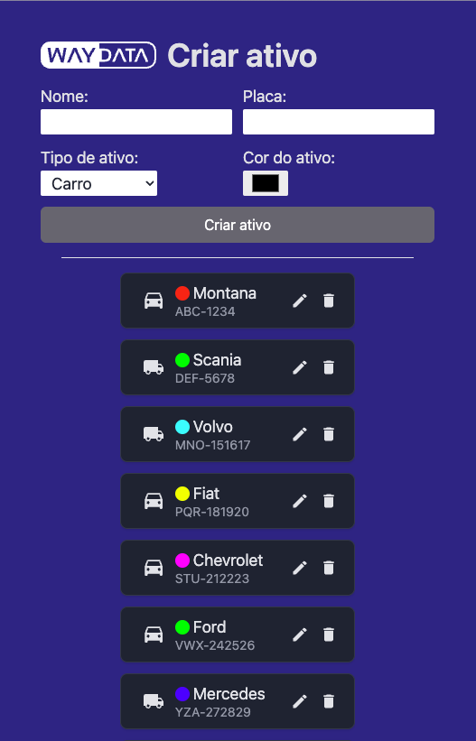

#  Desafio Técnico para Desenvolvedor Front-End Júnior - Way Data Solution

## Descrição do Projeto

O Ativo é uma entidade extremamente importante no contexto da Way Data. Ele representa um sensor que normalmente é instalado em caminhões ou câmaras frias para monitoramento de temperatura, umidade e GPS.

Você desenvolverá uma aplicação para gerenciamento de ativos de um cliente da Way Data.

<p align="center">
  
</p>

### Funcionalidades

1. **Visualizar ativos:** Exibir uma lista de todos os ativos disponíveis.
2. **Adicionar novo ativo:** Através de um formulário, permitir a inserção de novos ativos.
3. **Deletar ativo existente:** Ao clicar em botão na lista de ativos, o mesmo deve ser deletado.
4. **Editar ativo existente:** Ao clicar em um ativo da lista, o formulário de adicionar deve mudar para modo de edição, permitindo atualizar os dados.

### Modelo de Dados

Os ativos são representados pelo seguinte JSON:

```json
{
  "codigo": 0,
  "nome": "string",
  "placa": "string",
  "cor": "#000000",
  "tipoAtivo": "carro"
}
```

### Integração com API

A aplicação deve interagir com uma API RESTful cuja url será disponibilizada no momento do teste. As endpoints utilizadas serão:

- **GET /v1/ativo**: Retorna um array de ativos.
- **POST /v1/ativo**: Cria um novo ativo.
- **DELETE /v1/ativo/:codigo**: Remove um ativo existente.
- **PUT /v1/ativo/:codigo**: Atualiza um ativo existente.

### Tokens

```json
{
  "bg": "#1E3A8A", // bg-blue-900
  "bg-button": "#71717A", // bg-zinc-500
  "bg-card": "#202937", // bg-gray-800
  "text": "#E4E4E7" // text-gray-200
}
```

```css
::-webkit-scrollbar: {
  width: 8px;
  height: 8px;
}
::-webkit-scrollbar-track: {
  background: transparent;
},
::-webkit-scrollbar-thumb: {
  background: #AAAFB9;
  border-radius: 5px;
},
::-webkit-scrollbar-thumb:hover: {
  background: #AAAFB9;
},
```

## Entrevista Técnica

- Duração: Máximo de 1 hora e 10 minutos;
- Compartilhe a tela do seu computador durante a entrevista para acompanhamento;
- Certifique-se de ter uma boa conexão de internet;
- Será permitido o uso do Google, porém, o entrevistador pode ajudar em muitos dos questionamentos;

Antes da entrevista, siga os passos abaixo:

1. Crie um projeto usando Vite com o template TypeScript React utilizando `npm`.
2. Limpe o projeto removendo arquivos desnecessários.
3. Prepare seu ambiente de desenvolvimento com as ferramentas que você está acostumado a usar.

## Expectativas

Durante o teste, esperamos observar:

- **Comunicação:** Sua habilidade de explicar o que está sendo feito.
- **Organização do código:** Estrutura e clareza do seu código.
- **Capacidade de resolução de problemas:** Como você enfrenta desafios e resolve problemas.
- **Conhecimento técnico:** Seu domínio de React, HTML, CSS, e TypeScript.
- **Uso do ecossistema de desenvolvimento:** Eficiência no uso de ferramentas e bibliotecas disponíveis.

Note que finalizar a aplicação não é o único critério avaliado. Mesmo que não consiga finalizar, o processo e abordagem serão avaliados.

## Criatividade e Proatividade

Encorajamos você a usar qualquer tecnologia dentro do ecossistema React/JavaScript que achar conveniente, e a ser criativo e proativo na resolução do teste.

Boa sorte!
